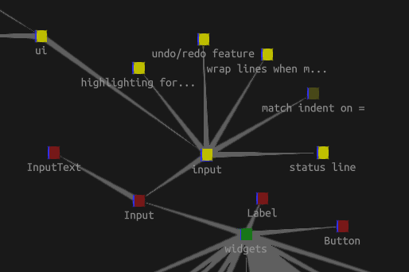

# Concepts

space is a novel type of operating system interface based on the following concepts.

## 3D

Aside from supporting visualization and gaming, 3D enables new types of UI widgets and workflows.

In-world video playback via [ffmpeg](https://ffmpeg.org/).
Embedded browsing via [Chromium Embedded Framework](https://github.com/chromiumembedded).

## Fennel Scripting

[Fennel](https://fennel-lang.org/), a Lisp based on the Lua runtime, provides a flexible, lightweight,
and easy-to-sandbox scripting language for space.

## Space Apps

Workflow-based, deeply integrated programs running in space. Unlike the isolated programs
in traditional desktops that merely interact via clipboard and drag/drop. Imagine, Unix piping in 3D.

## Virtual Worlds

Offline-first virtual worlds using local storage (files, sqlite) and
[Matrix](https://matrix.org) as the federated, e2e-encrypted communication protocol for sync.

Lua sandboxing for shared client-side code.

## Collaboration

Real-time code sharing, document editing, kanban boards, etc. in a shared virtual space.
Live collaboration features supported by techniques such as CRDT.

Entities sent through Matrix rooms replace git as the collaboration backend.

## Space Pods

Bundles of services run by users. Includes, for example, [Conduit](https://docs.conduit.rs/) as a Matrix homeserver and [coturn](https://github.com/coturn/coturn) for voice chat. Assisted space pod deployments to common hosting providers. Non-technical users should be able to host their own pods just by entering hosting provider credentials.

space pods must be lightweight and cheap to run to encourage decentralization.
To keep space pods lean, use [libtorrent](https://www.libtorrent.org/) for assets.

Eventually, space pods will become distributors of space itself (code, binaries, landing page with docs).
This will decentralize the development of space and enable its organic evolution
based on varying user needs.
Users will obtain space from pods run by friends and trusted institutions rather than central weak points such as this site.


## Gaming

Build and play games in shared virtual worlds. Reuse and modify assets and logic.

space provides essential game features. Avatars and skeletal animation.
[yojimbo](https://github.com/mas-bandwidth/yojimbo) for networking. OpenGL for graphics. Bullet for physics. OpenAL for spatial audio.
Social features (matchmaking, chat, etc.) based on the Matrix protocol.

## Blockchain

Multi-currency wallet for easy value exchange between users.
Enable users and space apps to build blockchain-based systems.
space itself does not participate in this economy.

## Decoupled UI

Rather than directly mapping business logic to views, introduce an abstract UI representation.

```fennel
; Instead of:
(fn view [items]
  (Column {:children (icollect [_ item (ipairs items)]
                               (Button {:title item.name}))}))

; Abstract view:
(fn view [items]
  (List {:children (icollect [_ item (ipairs items)]
                             (Action {:label item.name}))}))
```

Enables the independent innovation of UI. All types of UI (2D/3D, graphical, command-line, audio, ...) immediately available for all business logic.

## Window Management

[wlroots](https://gitlab.freedesktop.org/wlroots/wlroots) for running desktop apps in space, making it a window manager.

## Live Programming

Based on the principles of [Malleable Systems](https://malleable.systems/), space unifies development and usage of software. Control-click on anything in space to inspect and modify its runtime state as well as its code.

## Entity-based Programming

Represent anything (code, function, list, note, movie, ...) as an entity. Essentially, persistent data structures with UUIDs. Enables flexible knowledge management and code organization. Directly connect code entities with tasks, notes, errors, LLM conversations etc.

The following image illustrates Python classes represented as class entities (red) connected to task entities (yellow) organized in a graph entity.



As a next step, code may use entity relationships for its semantics.

## Space Graph

The space graph ties together all features of space and space-based apps and provides a uniform interaction model.
Nodes and edges are dynamically computed as requested.

## Visual Programming

Combined with [Moldable Development](https://moldabledevelopment.com/) any aspect of programming may become visual.
Drag and organize code elements in 3D space. Create interactive visual representations for code designs.
Build cities as representations and visual aids of programs.
Imagine a Google Maps/Street View-like view for code, data and notes.
Add game features to aid creative thinking, e.g. car racing between code blocks.

## Language L

A potential future language for space, similar to Fennel, with additional features.

- Programming Across Abstraction Levels: Easily mix high-level code with low-level code. In the following example `zero-buffer` is a JIT-compiled (e.g. via libgccjit) C function subsequently called from L:

```
(local zero-buffer
  (c-fn [(buf :char*) (len :int)] :void
    (memset buf 0 len)))

; Zero a buffer of 16 bytes
(zero-buffer buf 16)
```

By generating low-level code from a high-level language, the technically complex medium-level (C++/Rust) may be skipped entirely.

- Load libraries or programs at runtime without prior linking e.g. via `dlopen` or `exec`. Enables space to function as a full operating system with runtime access to virtually all software.
- Zero-overhead Permission System: Enforced during JIT compilation at runtime, enabling the seamless integration of code from a multitude of sources. Avoid the complexity of static analysis by enforcing permissions at the compilation output stage. Interactively require user permission as part of the compilation process. For example, if code attempts access to a file system node, the compiler refuses to output a program containing such an action unless authorized by the user. Similar to WASM's capability model. Also enables sophisticated multiplayer coding games by removing the need for isolation.
- Personal Syntax Views: Language customizations that can be applied bidirectionally form part of a personal syntax view unique to the developer and not shared with collaborators as part of the code. For example, formatting (e.g. spaces vs tabs), or even some convenience macros.
